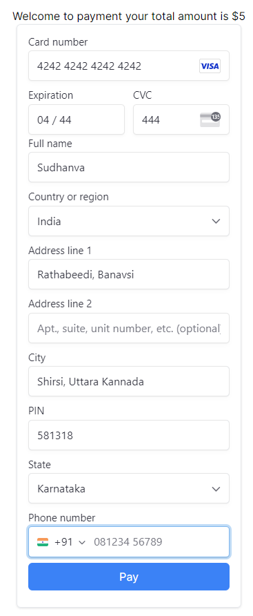
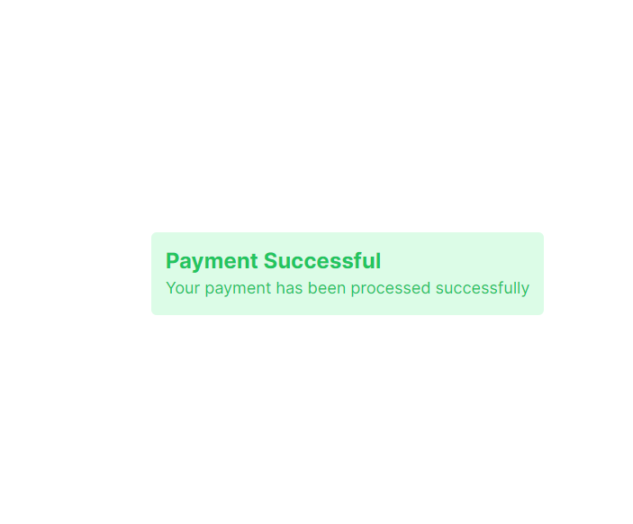
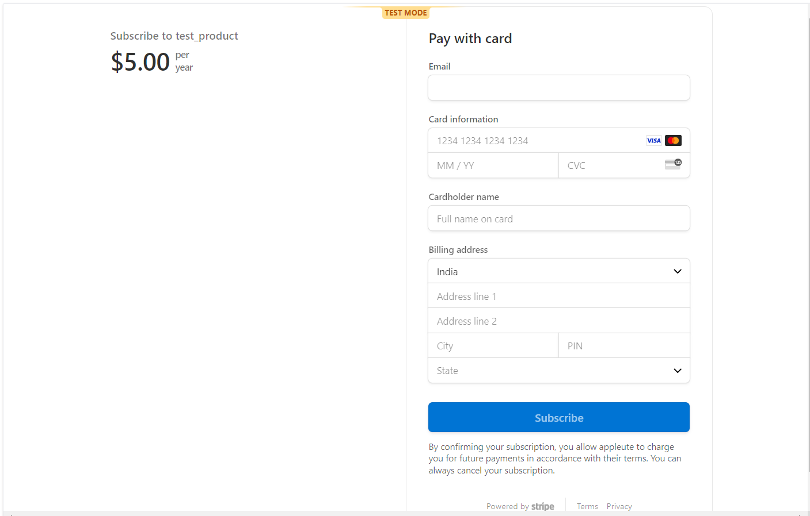
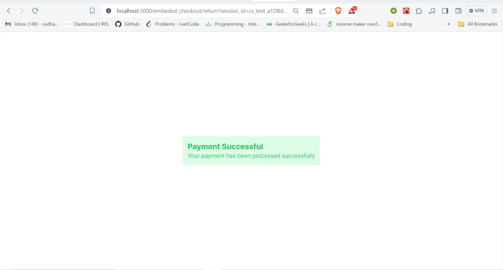

This is a [Next.js](https://nextjs.org/) project bootstrapped with [`create-next-app`](https://github.com/vercel/next.js/tree/canary/packages/create-next-app).

## Project setup

1. Clone the repository
    ```bash
    git clone `url` && cd stripemodule
    ```
    <br />

2. Install the dependencies
    ```bash
    npm install
    ```
    <br />

3. Set up the `.env` file
    ```bash
    NEXT_PUBLIC_STRIPE_PRICE_ID=<Your product price id from Stripe(this is foor one time payment for a product)>
    NEXT_PUBLIC_STRIPE_PUBLISHABLE_KEY=<Stripe publishable key to load Stripe in thr client side>
    STRIPE_SECRET_KEY=<Stripe secret key to intract with its api>
    ```

    Add these keys to `.env.example` and rename it to `.env` or `.env.local`
    <br />

4. Run the project

- Run the json server first:
    ```bash
    npm run db
    ```
    you can access the json server on http://localhost:5713/subscriptionDetails/

    <br />

- Run the app
    ```bash
    npm run dev
    ```
    Access the app on http://localhost:3000

## Details
- on http://localhost:3000 we can access the Payment form for one time payment.

- After payment success it will be redirected to /completion page


- http://localhost:3000/embeded_checkout
    click on pay now button then we can see Embeded checkout form.

    This is used for subscription methid ot recurring payment methods. After the payment is processed we will be redirected to `/embeded_checkout/return?session_id`. On this It will check if the payment is successfull and then saves the subsription details to the db.


### Api Endpoints:
- http://localhost:3000/api/stripe : Creates the payment intent for the one time subscription and sends the client secrete
- http://localhost:3000/api/stripe/session : Creates the subscription session and returns client secrete and session id
- http://localhost:3000/api/stripe/process : Process the subscription payments and store the expiry date one db.

- To get the user subscription we can use custom hook `useSubscriptionPlan`(on client side) or `getUserSubscriptionPlan` on the server side. Based on this we can have different features for free tier and pro tier users.